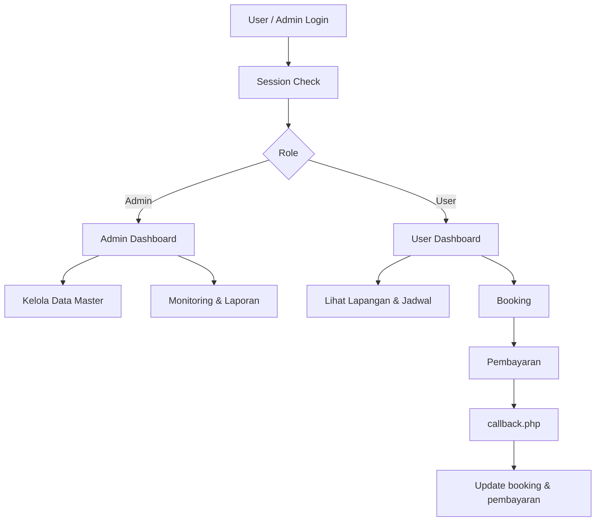

# Futsal Booking Wanasaba

Aplikasi booking lapangan futsal berbasis PHP Native dan MySQL, dengan alur admin dan user untuk kelola lapangan, jadwal, booking, pembayaran, dan laporan.

## Versi Singkat Untuk Pengumpulan

Sistem ini dibuat untuk memudahkan booking lapangan futsal secara online. Admin dapat mengelola user, lapangan, jadwal, booking, dan laporan. User dapat melihat lapangan, memilih jadwal, melakukan booking, dan memantau pembayaran serta riwayat transaksi. Proyek ini sudah dilengkapi seed data demo, dashboard live, dan callback pembayaran sehingga siap digunakan untuk demo lokal maupun presentasi tugas.

## Ringkasan Cepat

- Backend: PHP Native
- Database: MySQL
- Role: Admin dan User
- Fitur inti: login, booking, pembayaran, laporan, CRUD master data
- Demo admin: `admin@bookingfutsal.local` / `admin123`
- Demo user: `userdemo@bookingfutsal.local` / `user123`

## Teknologi

- Backend: PHP Native
- Database: MySQL
- Frontend: HTML, CSS, JavaScript
- Server: XAMPP / Apache

## Fitur

### Auth
- Login
- Register
- Logout
- Session-based role access

### Admin
- Dashboard statistik
- CRUD user
- CRUD lapangan
- CRUD jadwal
- Monitoring booking
- Laporan harian / bulanan
- Export CSV / XLS

### User
- Dashboard user
- Lihat lapangan
- Lihat jadwal
- Booking online
- Pembayaran
- Riwayat booking

## Struktur Folder

- `config/` - koneksi database dan konfigurasi aplikasi
- `includes/` - header, footer, dan helper session
- `auth/` - login, register, logout
- `admin/` - halaman admin
- `user/` - halaman user
- `assets/` - file CSS dan aset lain
- `database/` - file schema SQL
- `callback.php` - endpoint update status pembayaran

## Data Demo

File `database/schema.sql` juga menyertakan seed data awal supaya aplikasi langsung bisa dites:

- 1 akun admin default
- 3 data lapangan contoh
- beberapa jadwal contoh untuk masing-masing lapangan

## Instalasi

1. Pastikan XAMPP sudah terpasang dan Apache + MySQL dalam keadaan running.
2. Copy folder proyek ke `htdocs` XAMPP, misalnya:
   - `C:\xampp\htdocs\PROJEK 2BLN`
3. Buka `phpMyAdmin` lewat browser.
4. Buat database baru dengan nama `booking_futsal`.
5. Import file `database/schema.sql` ke database tersebut.
6. Jika perlu, sesuaikan kredensial MySQL di `config/koneksi.php`.
7. Buka aplikasi lewat browser:
   - `http://localhost/PROJEK%202BLN`
8. Login menggunakan akun demo atau admin default untuk mencoba alur aplikasi.

### Checklist Cepat

- Apache sudah `running`
- MySQL sudah `running`
- Database `booking_futsal` sudah dibuat
- `schema.sql` sudah di-import
- Path project sudah benar di folder `htdocs`

## Login Default Admin

Jika data awal schema dipakai, akun admin default:

- Email: `admin@bookingfutsal.local`
- Password: `admin123`

### Login Demo User

Untuk mencoba alur user secara langsung, gunakan akun demo berikut:

- Email: `userdemo@bookingfutsal.local`
- Password: `user123`

Jika ingin mengganti password admin, update data user setelah login pertama atau ubah hash seed di `database/schema.sql`.

## Troubleshooting

- Jika halaman tidak terbuka, pastikan URL folder sesuai nama folder di `htdocs`.
- Jika error koneksi database muncul, cek user, password, dan nama database di `config/koneksi.php`.
- Jika data demo tidak muncul, import ulang `database/schema.sql` ke database yang benar.
- Jika pembayaran atau callback gagal di test lokal, pastikan `PAYMENT_CALLBACK_TOKEN` di `config/config.php` sesuai dengan request yang dikirim.

## Panduan Penggunaan

### Admin

1. Login sebagai admin.
2. Buka dashboard untuk melihat statistik booking, pendapatan, dan aktivitas terakhir.
3. Gunakan menu `Kelola User` untuk tambah, ubah, atau hapus akun.
4. Gunakan menu `Kelola Lapangan` untuk mengatur data lapangan dan status ketersediaan.
5. Gunakan menu `Kelola Jadwal` untuk membuat slot waktu booking.
6. Gunakan menu `Monitoring Booking` untuk melihat transaksi dari user.
7. Gunakan menu `Laporan` untuk filter data harian/bulanan dan export CSV/XLS.

### User

1. Login sebagai user atau buat akun baru.
2. Buka menu `Lihat Lapangan` untuk melihat harga dan status lapangan.
3. Buka menu `Lihat Jadwal` untuk mencari slot yang tersedia.
4. Pilih jadwal lalu simpan booking.
5. Lanjut ke halaman pembayaran untuk melihat status transaksi.
6. Buka `Riwayat` untuk memantau booking sebelumnya.

## Checklist Demo

- Admin bisa login dan melihat dashboard statistik
- Admin bisa membuka halaman user, lapangan, jadwal, booking, dan laporan
- User bisa register, login, dan membuat booking
- User bisa melihat riwayat dan halaman pembayaran
- Seed data demo berhasil tampil setelah import database
- Callback update status pembayaran sudah tersedia di `callback.php`

## Ringkasan Halaman

### Auth

- `auth/login.php` - login admin dan user
- `auth/register.php` - pendaftaran user baru
- `auth/logout.php` - logout session

### Admin

- `admin/dashboard_admin.php` - statistik dan aktivitas terbaru
- `admin/users.php` - kelola akun user
- `admin/lapangan.php` - kelola data lapangan
- `admin/jadwal.php` - kelola slot jadwal
- `admin/booking.php` - monitoring booking
- `admin/laporan.php` - laporan dan export data

### User

- `user/dashboard_user.php` - ringkasan booking dan pembayaran user
- `user/lapangan.php` - daftar lapangan
- `user/jadwal.php` - filter jadwal
- `user/booking.php` - simpan booking
- `user/pembayaran.php` - konfirmasi pembayaran
- `user/riwayat.php` - riwayat booking user

## Deployment Checklist

- Import `database/schema.sql` ke database `booking_futsal`
- Pastikan `config/koneksi.php` sesuai environment lokal
- Pastikan `config/config.php` berisi `BASE_URL` yang benar
- Ganti `PAYMENT_CALLBACK_TOKEN` sebelum dipakai di production
- Isi `MIDTRANS_SERVER_KEY`, `MIDTRANS_CLIENT_KEY`, atau `XENDIT_API_KEY` jika integrasi gateway diaktifkan
- Cek `callback.php` dapat diakses dari server yang sama atau endpoint webhook yang sesuai
- Uji login admin, login user demo, booking, pembayaran, dan laporan sebelum demo

## Catatan Presentasi

Gunakan urutan singkat ini saat menjelaskan proyek:

1. Jelaskan tujuan aplikasi: booking lapangan futsal dengan alur admin dan user.
2. Tunjukkan halaman landing, lalu login admin dan user demo.
3. Demo admin: dashboard, kelola user, lapangan, jadwal, booking, dan laporan.
4. Demo user: lihat lapangan, pilih jadwal, booking, pembayaran, dan riwayat.
5. Tunjukkan seed data demo agar reviewer tahu proyek langsung siap dijalankan.

### Poin Penting yang Bisa Disebut

- Session dan role dipakai untuk memisahkan akses admin dan user.
- Booking langsung membuat data pembayaran dengan status awal `pending`.
- Callback pembayaran memperbarui status booking dan pembayaran secara bersamaan.
- Laporan bisa difilter dan diexport untuk kebutuhan administrasi.
- Seed data memudahkan demo tanpa input manual dari nol.

### Skrip Singkat 1 Menit

"Proyek ini adalah sistem booking lapangan futsal berbasis PHP Native dan MySQL. Ada dua role utama, yaitu admin dan user. Admin bisa mengelola user, lapangan, jadwal, melihat booking, dan membuat laporan. User bisa melihat lapangan, memilih jadwal, melakukan booking, lalu memantau pembayaran dan riwayat booking. Sistem ini sudah dilengkapi seed data demo, dashboard live, dan callback pembayaran, jadi siap digunakan untuk demo lokal maupun presentasi tugas."

## FAQ Singkat

- **Kenapa pakai PHP Native?** Karena struktur sederhana, mudah dipahami, dan cocok untuk implementasi CRUD serta alur booking dasar.
- **Kenapa ada seed data demo?** Supaya aplikasi langsung bisa dicoba tanpa input data dari nol.
- **Apa fungsi callback?** Untuk memperbarui status pembayaran dan booking setelah transaksi diproses.
- **Apa perbedaan admin dan user?** Admin mengelola data dan laporan, sedangkan user melakukan booking dan memantau transaksi.
- **Apakah bisa diintegrasikan ke Midtrans atau Xendit asli?** Bisa, karena konfigurasi dan endpoint callback sudah disiapkan.

## Arsitektur Singkat

- Koneksi database ditangani di `config/koneksi.php`.
- Pengaturan aplikasi dan token callback ada di `config/config.php`.
- Helper session dan flash message ada di `includes/session.php`.
- Callback pembayaran memperbarui data booking dan pembayaran secara bersamaan.

## Konfigurasi Penting

File `config/config.php` berisi konfigurasi utama:

- `APP_NAME`
- `BASE_URL`
- `PAYMENT_CALLBACK_URL`
- `PAYMENT_CALLBACK_TOKEN`
- `MIDTRANS_SERVER_KEY`
- `MIDTRANS_CLIENT_KEY`
- `XENDIT_API_KEY`

Sebelum production, ganti `PAYMENT_CALLBACK_TOKEN` dan isi key payment gateway yang dipakai.

## Alur Aplikasi

### User
1. Register atau login.
2. Lihat lapangan dan jadwal.
3. Pilih slot jadwal.
4. Simpan booking.
5. Lanjut ke pembayaran.
6. Pantau riwayat booking.

### Admin
1. Login sebagai admin.
2. Kelola user, lapangan, dan jadwal.
3. Monitor booking.
4. Lihat laporan dan export data.

## Catatan

- Status booking dan pembayaran disimpan di database.
- Callback pembayaran berada di `callback.php` dan menggunakan token keamanan.
- Dashboard admin dan user sudah terhubung ke data live dari database.
